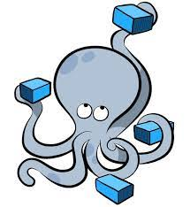

# Whales

## Docker containers

A 42 exercise to learn docker and docker-compose. The aim is to create a local server composed of several services.
Each service is a container. All server are connected through a network and each container <b>must be build from a debian image</b>.
For exemple using : `FROM wordpress:latest` is forbidden.

## Dockerfiles


Each container has its own <b>Dockerfile</b>. The Dockerfiles are located in the `srcs` folder.</br>
Here the different containers/services :

* 🐋 wordpress - <i>content management system for website and blogs</i>
* 🐋 mariadb - <i>database management system</i>
* 🐋 nginx - <i>a web and reverse proxy server</i>
* 🐋 adminer - <i>a lightweight database management tool</i>
* 🐋 cAdvisor - <i>a tool for monitoring container performance</i>
* 🐋 ftp_server - <i>to transfer files using the File Transfer Protocol </i>
* 🐋 myWebsite - <i>a simple html page displayed</i>
* 🐋 redis - <i>a caching and data storage tool</i>

## Docker-compose



All dockers are linked together through a network. The network and all containers are created in the `docker-compose.yml` file.
Simply using the command :

``` bash
docker-compose up
```
To communicate, the containers uses ports.

``` bash
ports:
  - "8080:80"
```
here, in this example, the port 8080 of the host is linked to the port 80 of the container.